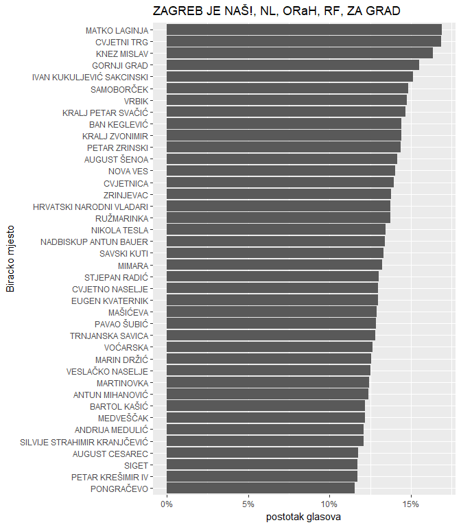

Rezultati izbora
================

R skripta za učitavanje DIP-ovih podataka o rezultatima glasovanja. [Izvor podataka](http://www.izbori.hr/arhiva-izbora/index.html#/app/home)

Trenutno je dostupna skripta za učitavanje podataka o lokalnim izborima 2017. godine.

Primjer korištenja:

``` r
xlsx_file_path_1krug <- "data/Lokalni/2017/rezultati1krug/ZUP_21/Excel/21.xlsx"
xlsx_file_path_2krug <- "data/Lokalni/2017/rezultati2krug/ZUP_021/Excel/21.xlsx"

krug_1 <- lokalni_izbori_procitaj(xlsx_file_path_1krug, drugi_krug = FALSE)
krug_2 <- lokalni_izbori_procitaj(xlsx_file_path_2krug, drugi_krug = TRUE)

# statistike prema birackim mjestima
krug_1$skupstina$header %>%
    sample_n(10) %>%
    kable(format = 'html') %>%
    kable_styling(bootstrap_options = "striped", font_size = 9)
```

<table class="table table-striped" style="font-size: 9px; margin-left: auto; margin-right: auto;">
<thead>
<tr>
<th style="text-align:right;">
bm\_id
</th>
<th style="text-align:left;">
zupanija\_id
</th>
<th style="text-align:left;">
Županija
</th>
<th style="text-align:left;">
Oznaka GROP
</th>
<th style="text-align:left;">
Grad/općina
</th>
<th style="text-align:left;">
Rbr BM
</th>
<th style="text-align:left;">
Naziv BM
</th>
<th style="text-align:left;">
Lokacija BM
</th>
<th style="text-align:left;">
Adresa BM
</th>
<th style="text-align:right;">
Ukupno birača
</th>
<th style="text-align:right;">
Glasovalo birača
</th>
<th style="text-align:right;">
Glasovalo birača (po listićima)
</th>
<th style="text-align:right;">
Važeći listići
</th>
<th style="text-align:right;">
Nevažeći listići
</th>
</tr>
</thead>
<tbody>
<tr>
<td style="text-align:right;">
306
</td>
<td style="text-align:left;">
21
</td>
<td style="text-align:left;">
GRAD ZAGREB
</td>
<td style="text-align:left;">
grad
</td>
<td style="text-align:left;">
GRAD ZAGREB
</td>
<td style="text-align:left;">
306
</td>
<td style="text-align:left;">
1
</td>
<td style="text-align:left;">
NA
</td>
<td style="text-align:left;">
HORVATI - SREDNJACI
</td>
<td style="text-align:right;">
1040
</td>
<td style="text-align:right;">
493
</td>
<td style="text-align:right;">
493
</td>
<td style="text-align:right;">
484
</td>
<td style="text-align:right;">
9
</td>
</tr>
<tr>
<td style="text-align:right;">
335
</td>
<td style="text-align:left;">
21
</td>
<td style="text-align:left;">
GRAD ZAGREB
</td>
<td style="text-align:left;">
grad
</td>
<td style="text-align:left;">
GRAD ZAGREB
</td>
<td style="text-align:left;">
335
</td>
<td style="text-align:left;">
7
</td>
<td style="text-align:left;">
NA
</td>
<td style="text-align:left;">
VRBANI
</td>
<td style="text-align:right;">
1160
</td>
<td style="text-align:right;">
583
</td>
<td style="text-align:right;">
583
</td>
<td style="text-align:right;">
571
</td>
<td style="text-align:right;">
12
</td>
</tr>
<tr>
<td style="text-align:right;">
603
</td>
<td style="text-align:left;">
21
</td>
<td style="text-align:left;">
GRAD ZAGREB
</td>
<td style="text-align:left;">
grad
</td>
<td style="text-align:left;">
GRAD ZAGREB
</td>
<td style="text-align:left;">
603
</td>
<td style="text-align:left;">
7
</td>
<td style="text-align:left;">
NA
</td>
<td style="text-align:left;">
DRAGONOŽEC
</td>
<td style="text-align:right;">
772
</td>
<td style="text-align:right;">
404
</td>
<td style="text-align:right;">
404
</td>
<td style="text-align:right;">
395
</td>
<td style="text-align:right;">
9
</td>
</tr>
<tr>
<td style="text-align:right;">
483
</td>
<td style="text-align:left;">
21
</td>
<td style="text-align:left;">
GRAD ZAGREB
</td>
<td style="text-align:left;">
grad
</td>
<td style="text-align:left;">
GRAD ZAGREB
</td>
<td style="text-align:left;">
483
</td>
<td style="text-align:left;">
7
</td>
<td style="text-align:left;">
NA
</td>
<td style="text-align:left;">
GAJNICE
</td>
<td style="text-align:right;">
1048
</td>
<td style="text-align:right;">
493
</td>
<td style="text-align:right;">
492
</td>
<td style="text-align:right;">
482
</td>
<td style="text-align:right;">
10
</td>
</tr>
<tr>
<td style="text-align:right;">
477
</td>
<td style="text-align:left;">
21
</td>
<td style="text-align:left;">
GRAD ZAGREB
</td>
<td style="text-align:left;">
grad
</td>
<td style="text-align:left;">
GRAD ZAGREB
</td>
<td style="text-align:left;">
477
</td>
<td style="text-align:left;">
1
</td>
<td style="text-align:left;">
NA
</td>
<td style="text-align:left;">
VRAPČE-JUG
</td>
<td style="text-align:right;">
1146
</td>
<td style="text-align:right;">
457
</td>
<td style="text-align:right;">
457
</td>
<td style="text-align:right;">
444
</td>
<td style="text-align:right;">
13
</td>
</tr>
<tr>
<td style="text-align:right;">
596
</td>
<td style="text-align:left;">
21
</td>
<td style="text-align:left;">
GRAD ZAGREB
</td>
<td style="text-align:left;">
grad
</td>
<td style="text-align:left;">
GRAD ZAGREB
</td>
<td style="text-align:left;">
596
</td>
<td style="text-align:left;">
2
</td>
<td style="text-align:left;">
NA
</td>
<td style="text-align:left;">
VUGROVEC GORNJI
</td>
<td style="text-align:right;">
305
</td>
<td style="text-align:right;">
157
</td>
<td style="text-align:right;">
157
</td>
<td style="text-align:right;">
154
</td>
<td style="text-align:right;">
3
</td>
</tr>
<tr>
<td style="text-align:right;">
15
</td>
<td style="text-align:left;">
21
</td>
<td style="text-align:left;">
GRAD ZAGREB
</td>
<td style="text-align:left;">
grad
</td>
<td style="text-align:left;">
GRAD ZAGREB
</td>
<td style="text-align:left;">
015
</td>
<td style="text-align:left;">
1
</td>
<td style="text-align:left;">
NA
</td>
<td style="text-align:left;">
KRALJ ZVONIMIR
</td>
<td style="text-align:right;">
1157
</td>
<td style="text-align:right;">
586
</td>
<td style="text-align:right;">
586
</td>
<td style="text-align:right;">
578
</td>
<td style="text-align:right;">
8
</td>
</tr>
<tr>
<td style="text-align:right;">
310
</td>
<td style="text-align:left;">
21
</td>
<td style="text-align:left;">
GRAD ZAGREB
</td>
<td style="text-align:left;">
grad
</td>
<td style="text-align:left;">
GRAD ZAGREB
</td>
<td style="text-align:left;">
310
</td>
<td style="text-align:left;">
7
</td>
<td style="text-align:left;">
NA
</td>
<td style="text-align:left;">
JARUN
</td>
<td style="text-align:right;">
1343
</td>
<td style="text-align:right;">
697
</td>
<td style="text-align:right;">
697
</td>
<td style="text-align:right;">
690
</td>
<td style="text-align:right;">
7
</td>
</tr>
<tr>
<td style="text-align:right;">
461
</td>
<td style="text-align:left;">
21
</td>
<td style="text-align:left;">
GRAD ZAGREB
</td>
<td style="text-align:left;">
grad
</td>
<td style="text-align:left;">
GRAD ZAGREB
</td>
<td style="text-align:left;">
461
</td>
<td style="text-align:left;">
7
</td>
<td style="text-align:left;">
NA
</td>
<td style="text-align:left;">
ŠPANSKO-JUG
</td>
<td style="text-align:right;">
1413
</td>
<td style="text-align:right;">
783
</td>
<td style="text-align:right;">
782
</td>
<td style="text-align:right;">
777
</td>
<td style="text-align:right;">
5
</td>
</tr>
<tr>
<td style="text-align:right;">
479
</td>
<td style="text-align:left;">
21
</td>
<td style="text-align:left;">
GRAD ZAGREB
</td>
<td style="text-align:left;">
grad
</td>
<td style="text-align:left;">
GRAD ZAGREB
</td>
<td style="text-align:left;">
479
</td>
<td style="text-align:left;">
1
</td>
<td style="text-align:left;">
NA
</td>
<td style="text-align:left;">
VRAPČE-JUG
</td>
<td style="text-align:right;">
1173
</td>
<td style="text-align:right;">
524
</td>
<td style="text-align:right;">
524
</td>
<td style="text-align:right;">
512
</td>
<td style="text-align:right;">
12
</td>
</tr>
</tbody>
</table>
``` r
# glasovi prema birackim mjestima
krug_1$skupstina$glasovi %>%
    sample_n(20) %>%
    kable(format = 'html') %>%
    kable_styling(bootstrap_options = "striped", font_size = 9)
```

<table class="table table-striped" style="font-size: 9px; margin-left: auto; margin-right: auto;">
<thead>
<tr>
<th style="text-align:right;">
bm\_id
</th>
<th style="text-align:left;">
zupanija\_id
</th>
<th style="text-align:left;">
Lista
</th>
<th style="text-align:right;">
Glasova
</th>
</tr>
</thead>
<tbody>
<tr>
<td style="text-align:right;">
149
</td>
<td style="text-align:left;">
21
</td>
<td style="text-align:left;">
HRVATSKA BRANITELJSKA PUČKA STRANKA - HBPS
</td>
<td style="text-align:right;">
0
</td>
</tr>
<tr>
<td style="text-align:right;">
415
</td>
<td style="text-align:left;">
21
</td>
<td style="text-align:left;">
HRVATSKA STRANKA PRAVA DR. ANTE STARČEVIĆ - HSP AS
</td>
<td style="text-align:right;">
3
</td>
</tr>
<tr>
<td style="text-align:right;">
587
</td>
<td style="text-align:left;">
21
</td>
<td style="text-align:left;">
ŽIVI ZID, PROMIJENIMO HRVATSKU - PH
</td>
<td style="text-align:right;">
26
</td>
</tr>
<tr>
<td style="text-align:right;">
37
</td>
<td style="text-align:left;">
21
</td>
<td style="text-align:left;">
PAMETNO
</td>
<td style="text-align:right;">
8
</td>
</tr>
<tr>
<td style="text-align:right;">
353
</td>
<td style="text-align:left;">
21
</td>
<td style="text-align:left;">
HRVATSKA BRANITELJSKA PUČKA STRANKA - HBPS
</td>
<td style="text-align:right;">
0
</td>
</tr>
<tr>
<td style="text-align:right;">
434
</td>
<td style="text-align:left;">
21
</td>
<td style="text-align:left;">
DEMOKRATSKA STRANKA ŽENA - DSŽ, SLOBODNA HRVATSKA - SH
</td>
<td style="text-align:right;">
0
</td>
</tr>
<tr>
<td style="text-align:right;">
136
</td>
<td style="text-align:left;">
21
</td>
<td style="text-align:left;">
HRVATSKA BRANITELJSKA PUČKA STRANKA - HBPS
</td>
<td style="text-align:right;">
1
</td>
</tr>
<tr>
<td style="text-align:right;">
530
</td>
<td style="text-align:left;">
21
</td>
<td style="text-align:left;">
MOST NEZAVISNIH LISTA - MOST
</td>
<td style="text-align:right;">
5
</td>
</tr>
<tr>
<td style="text-align:right;">
476
</td>
<td style="text-align:left;">
21
</td>
<td style="text-align:left;">
HRAST - POKRET ZA USPJEŠNU HRVATSKU, OBITELJSKA STRANKA - OS
</td>
<td style="text-align:right;">
2
</td>
</tr>
<tr>
<td style="text-align:right;">
584
</td>
<td style="text-align:left;">
21
</td>
<td style="text-align:left;">
NEZAVISNA LISTA SANDRE ŠVALJEK - NLSŠ, HRVATSKA SOCIJALNO - LIBERALNA STRANKA - HSLS, ZELENA STRANKA - ZS, HRVATSKA KONZERVATIVNA STRANKA - HKS
</td>
<td style="text-align:right;">
31
</td>
</tr>
<tr>
<td style="text-align:right;">
48
</td>
<td style="text-align:left;">
21
</td>
<td style="text-align:left;">
AUTOHTONA - HRVATSKA STRANKA PRAVA - A - HSP, HRVATSKA SELJAČKA STRANKA - STJEPAN RADIĆ - HSS - SR
</td>
<td style="text-align:right;">
1
</td>
</tr>
<tr>
<td style="text-align:right;">
25
</td>
<td style="text-align:left;">
21
</td>
<td style="text-align:left;">
KANDIDACIJSKA LISTA GRUPE BIRAČA - BRUNA ESIH
</td>
<td style="text-align:right;">
42
</td>
</tr>
<tr>
<td style="text-align:right;">
179
</td>
<td style="text-align:left;">
21
</td>
<td style="text-align:left;">
"BANDIĆ MILAN 365 - STRANKA RADA I SOLIDARNOSTI" - "STRANKA RADA I SOLIDARNOSTI", STRANKA MEĐUGENERACIJSKE SOLIDARNOSTI HRVATSKE - SMSH, ZELENA LISTA, NARODNA STRANKA - REFORMISTI - REFORMISTI
</td>
<td style="text-align:right;">
81
</td>
</tr>
<tr>
<td style="text-align:right;">
265
</td>
<td style="text-align:left;">
21
</td>
<td style="text-align:left;">
MOST NEZAVISNIH LISTA - MOST
</td>
<td style="text-align:right;">
27
</td>
</tr>
<tr>
<td style="text-align:right;">
384
</td>
<td style="text-align:left;">
21
</td>
<td style="text-align:left;">
KANDIDACIJSKA LISTA GRUPE BIRAČA - BRUNA ESIH
</td>
<td style="text-align:right;">
54
</td>
</tr>
<tr>
<td style="text-align:right;">
266
</td>
<td style="text-align:left;">
21
</td>
<td style="text-align:left;">
"BANDIĆ MILAN 365 - STRANKA RADA I SOLIDARNOSTI" - "STRANKA RADA I SOLIDARNOSTI", STRANKA MEĐUGENERACIJSKE SOLIDARNOSTI HRVATSKE - SMSH, ZELENA LISTA, NARODNA STRANKA - REFORMISTI - REFORMISTI
</td>
<td style="text-align:right;">
66
</td>
</tr>
<tr>
<td style="text-align:right;">
101
</td>
<td style="text-align:left;">
21
</td>
<td style="text-align:left;">
HRVATSKA DEMOKRATSKA STRANKA - HDS, HRVATSKA KRŠĆANSKA DEMOKRATSKA UNIJA - DR. MARKO VESELICA - HKDU - DR. MARKO VESELICA, UJEDINJENA STRANKA PRAVA - USP, POKRET ZAJEDNO - PZ
</td>
<td style="text-align:right;">
2
</td>
</tr>
<tr>
<td style="text-align:right;">
329
</td>
<td style="text-align:left;">
21
</td>
<td style="text-align:left;">
"BANDIĆ MILAN 365 - STRANKA RADA I SOLIDARNOSTI" - "STRANKA RADA I SOLIDARNOSTI", STRANKA MEĐUGENERACIJSKE SOLIDARNOSTI HRVATSKE - SMSH, ZELENA LISTA, NARODNA STRANKA - REFORMISTI - REFORMISTI
</td>
<td style="text-align:right;">
98
</td>
</tr>
<tr>
<td style="text-align:right;">
334
</td>
<td style="text-align:left;">
21
</td>
<td style="text-align:left;">
HRVATSKA BRANITELJSKA PUČKA STRANKA - HBPS
</td>
<td style="text-align:right;">
1
</td>
</tr>
<tr>
<td style="text-align:right;">
197
</td>
<td style="text-align:left;">
21
</td>
<td style="text-align:left;">
POKRET ZA MODERNU HRVATSKU
</td>
<td style="text-align:right;">
2
</td>
</tr>
</tbody>
</table>
``` r
# spajanje zaglavlja s glasovima po listama
krug_2$header %>%
    inner_join(
        krug_2$glasovi,
        by=c("bm_id"="bm_id","zupanija_id"="zupanija_id")
    ) %>%
    group_by(`Grad/općina`, `Adresa BM`, Lista) %>%
    summarise(
        Glasova = sum(Glasova),
        Vazecih_listica = sum(`Važeći listići`),
        Birackih_mjesta = n()
    ) %>%
    mutate(
        postotak = Glasova / Vazecih_listica
    ) %>%
    sample_n(1) %>%
    head(10) %>%
    kable(format = 'html') %>%
    kable_styling(bootstrap_options = "striped", font_size = 9)
```

<table class="table table-striped" style="font-size: 9px; margin-left: auto; margin-right: auto;">
<thead>
<tr>
<th style="text-align:left;">
Grad/općina
</th>
<th style="text-align:left;">
Adresa BM
</th>
<th style="text-align:left;">
Lista
</th>
<th style="text-align:right;">
Glasova
</th>
<th style="text-align:right;">
Vazecih\_listica
</th>
<th style="text-align:right;">
Birackih\_mjesta
</th>
<th style="text-align:right;">
postotak
</th>
</tr>
</thead>
<tbody>
<tr>
<td style="text-align:left;">
GRAD ZAGREB
</td>
<td style="text-align:left;">
1.  SVIBNJA 1990.
    </td>
    <td style="text-align:left;">
    ANKA MRAK-TARITAŠ
    </td>
    <td style="text-align:right;">
    551
    </td>
    <td style="text-align:right;">
    1949
    </td>
    <td style="text-align:right;">
    4
    </td>
    <td style="text-align:right;">
    0.2827091
    </td>
    </tr>
    <tr>
    <td style="text-align:left;">
    GRAD ZAGREB
    </td>
    <td style="text-align:left;">
    ADAMOVEC
    </td>
    <td style="text-align:left;">
    ANKA MRAK-TARITAŠ
    </td>
    <td style="text-align:right;">
    70
    </td>
    <td style="text-align:right;">
    315
    </td>
    <td style="text-align:right;">
    1
    </td>
    <td style="text-align:right;">
    0.2222222
    </td>
    </tr>
    <tr>
    <td style="text-align:left;">
    GRAD ZAGREB
    </td>
    <td style="text-align:left;">
    ANDRIJA MEDULIĆ
    </td>
    <td style="text-align:left;">
    ANKA MRAK-TARITAŠ
    </td>
    <td style="text-align:right;">
    516
    </td>
    <td style="text-align:right;">
    922
    </td>
    <td style="text-align:right;">
    2
    </td>
    <td style="text-align:right;">
    0.5596529
    </td>
    </tr>
    <tr>
    <td style="text-align:left;">
    GRAD ZAGREB
    </td>
    <td style="text-align:left;">
    ANTUN MIHANOVIĆ
    </td>
    <td style="text-align:left;">
    ANKA MRAK-TARITAŠ
    </td>
    <td style="text-align:right;">
    647
    </td>
    <td style="text-align:right;">
    1043
    </td>
    <td style="text-align:right;">
    2
    </td>
    <td style="text-align:right;">
    0.6203260
    </td>
    </tr>
    <tr>
    <td style="text-align:left;">
    GRAD ZAGREB
    </td>
    <td style="text-align:left;">
    AUGUST CESAREC
    </td>
    <td style="text-align:left;">
    ANKA MRAK-TARITAŠ
    </td>
    <td style="text-align:right;">
    271
    </td>
    <td style="text-align:right;">
    549
    </td>
    <td style="text-align:right;">
    1
    </td>
    <td style="text-align:right;">
    0.4936248
    </td>
    </tr>
    <tr>
    <td style="text-align:left;">
    GRAD ZAGREB
    </td>
    <td style="text-align:left;">
    AUGUST ŠENOA
    </td>
    <td style="text-align:left;">
    ANKA MRAK-TARITAŠ
    </td>
    <td style="text-align:right;">
    612
    </td>
    <td style="text-align:right;">
    1138
    </td>
    <td style="text-align:right;">
    2
    </td>
    <td style="text-align:right;">
    0.5377856
    </td>
    </tr>
    <tr>
    <td style="text-align:left;">
    GRAD ZAGREB
    </td>
    <td style="text-align:left;">
    BAN KEGLEVIĆ
    </td>
    <td style="text-align:left;">
    ANKA MRAK-TARITAŠ
    </td>
    <td style="text-align:right;">
    990
    </td>
    <td style="text-align:right;">
    1546
    </td>
    <td style="text-align:right;">
    3
    </td>
    <td style="text-align:right;">
    0.6403622
    </td>
    </tr>
    <tr>
    <td style="text-align:left;">
    GRAD ZAGREB
    </td>
    <td style="text-align:left;">
    BARTOL KAŠIĆ
    </td>
    <td style="text-align:left;">
    ANKA MRAK-TARITAŠ
    </td>
    <td style="text-align:right;">
    732
    </td>
    <td style="text-align:right;">
    1180
    </td>
    <td style="text-align:right;">
    3
    </td>
    <td style="text-align:right;">
    0.6203390
    </td>
    </tr>
    <tr>
    <td style="text-align:left;">
    GRAD ZAGREB
    </td>
    <td style="text-align:left;">
    BELOVAR
    </td>
    <td style="text-align:left;">
    MILAN BANDIĆ, mag. pol.
    </td>
    <td style="text-align:right;">
    167
    </td>
    <td style="text-align:right;">
    204
    </td>
    <td style="text-align:right;">
    1
    </td>
    <td style="text-align:right;">
    0.8186275
    </td>
    </tr>
    <tr>
    <td style="text-align:left;">
    GRAD ZAGREB
    </td>
    <td style="text-align:left;">
    BLAGUŠA
    </td>
    <td style="text-align:left;">
    ANKA MRAK-TARITAŠ
    </td>
    <td style="text-align:right;">
    48
    </td>
    <td style="text-align:right;">
    194
    </td>
    <td style="text-align:right;">
    1
    </td>
    <td style="text-align:right;">
    0.2474227
    </td>
    </tr>
    </tbody>
    </table>

``` r
# plot
krug_1$skupstina$header %>%
    inner_join(
        krug_1$skupstina$glasovi,
        by=c("bm_id"="bm_id","zupanija_id"="zupanija_id")
    ) %>%
    filter(grepl('Zagreb je naš', Lista, TRUE)) %>%
    group_by(`Grad/općina`, `Adresa BM`, Lista) %>%
    summarise(
        Glasova = sum(Glasova),
        Vazecih_listica = sum(`Važeći listići`),
        Birackih_mjesta = n()
    ) %>%
    mutate(
        postotak = Glasova / Vazecih_listica
    ) %>%
    arrange(-postotak) %>%
    head(40) %>%
    ggplot(aes(x = reorder(`Adresa BM`, postotak), y = postotak)) +
    geom_bar(stat='identity') +
    scale_y_continuous(labels = percent) +
    labs(
        x = 'Biracko mjesto', 
        y = 'postotak glasova',
        title = 'ZAGREB JE NAŠ!, NL, ORaH, RF, ZA GRAD'
    ) +
    coord_flip() +
    theme_gray()
```


